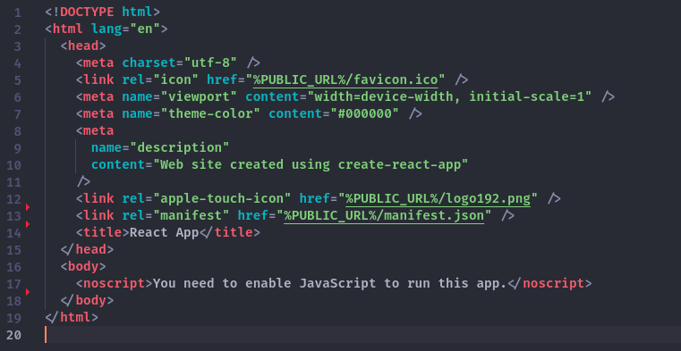
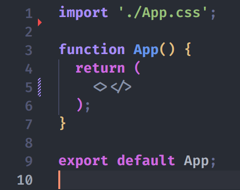

# WORKSHOP-Decouverte-React-et-MaterialUI

step 1: Crée votre projet react en utilisant le terminal.

step 2: Aller dans le fichier "index.html" et "App.js" et supprimer les lignes inutile afin d'avoir une page internet vierge





Et donc quand vous lancez votre appli grâce a la commande suivante:
```
npm start
```
vous vous retrouvez devant une page blanche.

# A vous de jouer

Le but de ce workshop est de decouvrir react tout en developpant votre propre calculatrice en ligne.

---
Tout d'abord, vous allez créer un champ sur votre site qui affichera le resultat des calculs.

Ensuite la création des différents bouttons qui vous permettrons de taper vos calculs à l'aide des composants React.

Une fois les boutons créés, il ne vous reste plus qu'à implémenter la gestion des différentes opérations pour reproduire le fonctionnement d'une calculatrice.

# Pour aller plus loin
---

Si vous avez fini toutes les étapes précédentes et que le workshop n'est pas encore fini, vous pouvez toujours améliorer votre projet en y ajoutant des fonctionnalités de calculatrice scientifique, comme par exemple un bouton pour calculer la racine carrée d'un nombre.